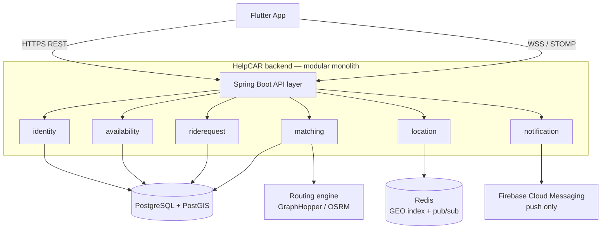
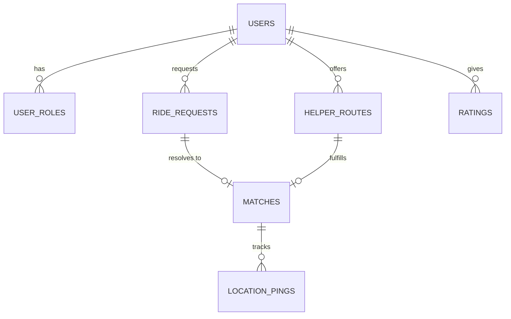
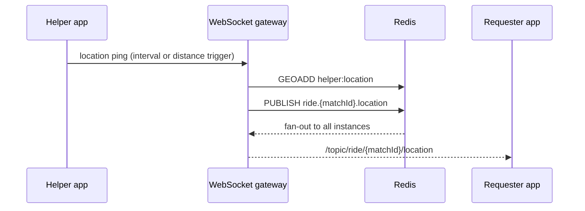

# ADR-001: HelpCAR backend architecture

| | |
| --- | --- |
| **Status** | Proposed |
| **Date** | 2026-08-29 |
| **Deciders** | Engineering owner |
| **Supersedes** | The client-side Firebase architecture in [`helpcar`](https://github.com/soumeshmohanty0220/helpcar) |

---

## 1. Context

The HelpCAR mobile app talks to Firebase Auth and Realtime Database directly from the
device. Four consequences of that shape drive this document:

1. **The client owns business logic.** Matching, pairing bookkeeping and location writes all
   happen in the Flutter app against Firebase, with no server-side validation of any of it.
2. **Identity is split-brained.** The registration screen POSTs credentials to a custom HTTP
   endpoint that never touches Firebase Auth, while login only checks Firebase Auth — so
   accounts created through the app can never sign in. The working registration code was
   replaced and left commented out in place.
3. **Secrets are committed.** The Google Maps API key is hardcoded in `configmaps.dart` and
   duplicated in a checked-in `google-services.json`, in a public repository.
4. **Matching does not scale or work correctly.** Every match attempt downloads the entire
   `users` node and runs a raw line-segment intersection test per record. Two routes crossing
   on a map says nothing about real detour cost, and the scan is O(n) per request.

None of this is fixable by patching the client. It needs a server that owns identity, ride
state and matching, with the phone reduced to a renderer of that state.

## 2. Decision

Build a standalone **Spring Boot (Java 21)** service backed by **PostgreSQL + PostGIS**,
exposing a versioned REST API plus a **STOMP-over-WebSocket** channel for live location and
match events. Keep Firebase for exactly one job: push notifications.

## 3. Goals and constraints

| Goal | Meaning |
| --- | --- |
| Correctness | One registration path that always yields a sign-in-able account; server-validated state transitions so a ride cannot be matched twice |
| Scale | Sub-second matching as active helper routes grow into the thousands per region — no full-table scans on the request path |
| Security | No keys or credentials in the client; TLS everywhere; passwords hashed server-side; every write authorised against the caller |
| Evolvability | Module boundaries firm enough that matching or location can become their own service without a rewrite |

## 4. High-level architecture

A **modular monolith**, not microservices. At a regional-volunteer-network scale, one
deployable with strictly enforced internal boundaries gets most of the maintainability of
microservices at a fraction of the operational cost: no service mesh, no distributed
transactions, one database to reason about. Boundaries are drawn so the two modules most
likely to outgrow the rest — `matching` and `location` — can be extracted later.



### 4.1 Modules

| Module | Owns | Depends on |
| --- | --- | --- |
| `identity` | Users, additive roles, credentials, JWT issuance | — |
| `availability` | Helper-offered routes: origin, destination, geometry, time window | `identity` |
| `riderequest` | Requester trips, mode, lifecycle status | `identity` |
| `matching` | The candidate pipeline, match records, accept/decline handshake | `availability`, `riderequest`, routing engine |
| `location` | Live position ingestion, Redis GEO, websocket fan-out | `matching` |
| `notification` | FCM push, in-app event log | all (event consumer) |

Each module is internally **ports and adapters**: a domain core with no framework imports,
an application layer of use cases, and adapters at the edges. That is what makes later
extraction realistic rather than aspirational.

## 5. Data model



See [`V1__initial_schema.sql`](../src/main/resources/db/migration/V1__initial_schema.sql)
for the authoritative definition. Two choices worth calling out:

- **`geography`, not `geometry`.** Distance maths happens on the spheroid and `ST_DWithin`
  takes metres directly. With `geometry` over lat/lon, "within 5000" would silently mean
  5000 *degrees*.
- **GiST indexes on every spatial column.** This is what makes stage 1 below an index seek.

## 6. The matching engine

The problem is a scoped-down **Dial-a-Ride Problem**: insert one pickup-then-dropoff pair
into an existing route at minimum extra cost, subject to a detour budget and a time window.
Four stages, each more precise and more expensive than the last, so the costly stage only
ever sees a handful of candidates.


### 6.1 Stage 1 — spatial candidate filter

```sql
SELECT id, helper_id, origin, destination, route_line, time_window
FROM helper_routes
WHERE status = 'ACTIVE'
  AND ST_DWithin(route_line, :pickup_point, :max_search_radius_m)
  AND time_window && :requested_time_window
ORDER BY route_line <-> :pickup_point   -- KNN operator, index-assisted nearest-first
LIMIT :max_candidates;
```

The `<->` KNN operator over the GiST index makes this an index-ordered scan: Postgres never
touches rows outside the radius. **O(log n + k)** instead of **O(n)** — the single biggest
correction over the current implementation.

### 6.2 Stage 2 — corridor and direction

A route passing near the pickup is not enough; the dropoff must lie further along the *same*
route in the *same* direction, inside a detour envelope.

```sql
SELECT id, helper_id,
       ST_LineLocatePoint(route_line, :pickup_point)  AS pickup_frac,
       ST_LineLocatePoint(route_line, :dropoff_point) AS dropoff_frac
FROM candidates
WHERE ST_DWithin(route_line, :pickup_point,  :max_detour_m)
  AND ST_DWithin(route_line, :dropoff_point, :max_detour_m)
  AND ST_LineLocatePoint(route_line, :pickup_point)
    < ST_LineLocatePoint(route_line, :dropoff_point);  -- correct travel direction
```

Pure geometry, no external calls. This is what eliminates the false positives the old
crossing-lines test produced.

### 6.3 Stage 3 — detour costing

For the survivors, get a real road-network cost from a self-hosted routing engine
(GraphHopper or OSRM — both use **contraction hierarchies**, pre-processing the road graph
so shortest-path queries answer in milliseconds):

```
detourCost(route, pickup, dropoff):
    direct     = roadDistance(route.origin, route.destination)
    withDetour = roadDistance(route.origin, pickup)
               + roadDistance(pickup, dropoff)
               + roadDistance(dropoff, route.destination)
    return withDetour - direct        // extra metres this rider costs the helper
```

This is the **cheapest-insertion** move from vehicle-routing heuristics, and it generalises
cleanly to multi-passenger carpooling later.

### 6.4 Stage 4 — ranking

```
score = w1 * normalize(detourMeters,          0, maxDetour)
      + w2 * normalize(minutesUntilDeparture, 0, windowSpan)
      + w3 * (1 - helperReliabilityRating)
// defaults: w1 = 0.5, w2 = 0.3, w3 = 0.2 — configurable per deployment
```

### 6.5 Concurrency

Two requesters can clear stages 1–4 against the same route in the same second. Accepting
takes an **optimistic lock** on `helper_routes.version`; the loser is re-run against the
next-best candidate rather than shown an error. A partial unique index
(`uq_matches_one_live_per_request`) enforces one live match per request in the database, so
a race cannot double-book even if service code is wrong.

### 6.6 Evolution path

The pipeline is **greedy** — best helper available right now. That is the right default, but
it is not globally optimal: two requests seconds apart can each take a locally-best helper
when swapping would have served both better. The standard upgrade is to accumulate requests
over a few seconds and solve a bipartite min-cost matching (**Hungarian algorithm**, O(k³) on
a small batch). Deliberately deferred — see §13.

## 7. Real-time layer



The Redis pub/sub hop matters as soon as there is more than one instance: a requester's
socket may be held by instance A while the helper's ping lands on instance B. Publishing
through Redis is what removes the need for sticky sessions.

Clients ping on an **interval-or-distance trigger** rather than every GPS tick — sending
every fix burns battery and bandwidth for no matching benefit.

## 8. API contract

REST under `/api/v1`: `auth/register`, `auth/login`, `auth/refresh`, `users/me`,
`helper-routes` (POST/DELETE), `ride-requests` (POST), `ride-requests/{id}/matches` (GET),
`ride-requests/{id}/select`, `matches/{id}/accept`, `matches/{id}/complete`,
`matches/{id}/cancel`.

STOMP destinations:

| Destination | Direction | Payload |
| --- | --- | --- |
| `/app/location.ping` | client → server | `{ lat, lon, ts }` |
| `/topic/ride/{matchId}/location` | server → client | helper position |
| `/topic/ride/{matchId}/status` | server → client | lifecycle transitions |
| `/user/queue/match-offers` | server → client | incoming offer (helper side) |

## 9. Security

Spring Security issues short-lived JWT access tokens plus a longer-lived refresh token;
passwords are BCrypt-hashed server-side. Resource ownership is checked at the service layer,
once, rather than re-implemented per endpoint. Roles are additive — a user can be both
`REQUESTER` and `HELPER`, matching how the product actually behaves.

This closes the two live issues from §1: the Maps/routing key moves server-side entirely
(the client never calls Google directly), and there is exactly one registration path over
TLS producing one consistent identity record.

Also applied: Bean Validation on every request DTO, rate limiting on `/auth/*` and
`/ride-requests`, and structured audit logging on every accept/cancel/complete.

## 10. Observability, testing, deployment

Integration tests run against real, ephemeral PostGIS via **Testcontainers** — the pipeline's
correctness depends on genuine spatial-index behaviour, so mocking the database would test
nothing. The matching endpoint additionally gets a load-test pass, since it is the path most
sensitive to the O(log n) claim holding under load. Metrics via Micrometer → Prometheus,
traces via OpenTelemetry, structured JSON logs so "why didn't this match" is answerable from
a match ID.

Deployment: Docker Compose locally; managed Postgres with PostGIS enabled in production; the
service as a container behind a load balancer, scaled horizontally once the Redis-backed
relay from §7 is in place. Schema changes go through Flyway, never manual DDL.

## 11. Migration plan

1. Stand up the backend and schema; leave Firebase untouched and live.
2. Migrate Firebase Auth users into `users` (passwords reset by email — Firebase does not
   export hashes).
3. Point the app's auth screens at `/api/v1/auth/*` behind a feature flag. This alone fixes
   the broken registration/login split.
4. Migrate helper routes and open requests, geocoding stored addresses into `geography`.
5. Switch matching from the client-side scan to `POST /ride-requests`; run both in parallel
   and compare before cutting over.
6. Replace Realtime Database listeners with the websocket subscriptions in §7.
7. Decommission Realtime Database and the custom registration endpoint. Keep FCM.

## 12. Flutter client changes

Swap direct `firebase_auth` / `firebase_database` calls for an HTTP client against the REST
API, store tokens in `flutter_secure_storage`, and use `stomp_dart_client` for the
subscriptions in §8. `firebase_messaging` stays, scoped to push. Net result: zero backend
logic and zero embedded secrets in the app.

## 13. Alternatives considered

**Service topology**

| Option | Verdict |
| --- | --- |
| Modular monolith | **Chosen.** Lowest operational cost, clean extraction seams |
| Microservices per module | Rejected for now — distributed transactions and a mesh are unjustified at this scale |
| Serverless functions | Rejected — cold starts fight the persistent-websocket requirement directly |

**Matching dispatch**

| Option | Verdict |
| --- | --- |
| Greedy, per request | **Chosen for v1.** Simple, low-latency, debuggable |
| Batched global assignment (Hungarian) | Future — better outcomes, added latency and complexity; revisit when density warrants |
| Full DARP solver | Rejected — overkill while each route carries one rider |

## 14. Consequences

**Easier:** matching correctness and performance become testable in isolation; secrets rotate
without an app release; a future web or partner client reuses the same API.

**Harder:** there is now a service to operate — deploys, migrations, on-call — where before
there was none; the team needs enough PostGIS familiarity to reason about §6.

**To revisit:** greedy vs batched matching once real data shows how often requests compete
for the same helper; whether `matching` and `location` need extracting once traffic patterns
are known.

## 15. Action items

- [x] Postgres + PostGIS via Docker Compose; schema applied by Flyway
- [x] Project scaffold with the module layout in §4.1
- [ ] Spring Security + JWT (`identity`)
- [ ] Stages 1–2 of the pipeline in SQL, covered by Testcontainers integration tests
- [ ] Self-hosted GraphHopper with a regional OSM extract; `RoutingPort` implementation
- [ ] STOMP layer and Redis location pipeline
- [ ] **Rotate the exposed Google Maps API key and restrict it in Google Cloud Console** —
      independent of this timeline, do it now
- [ ] Execute §11 one phase at a time behind feature flags
